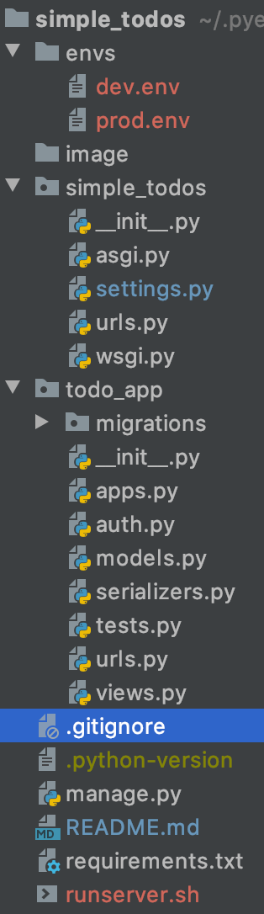

# simple_todos

## 개요

OpenAPI Specification에 따라 간단한 To-Do REST API를 구현한다.

## 구현 내용

1. 필수 구현
2. 이미지 업로드
3. Qeury Param에 API KEY 여부에 의한 Permission 지정(Authentication)
4. env 파일을 이용한 dev / prod 환경 분리

## 디렉토리 구조 상세

* envs: 환경 분리를 위한 환경에 따른 환경변수 파일들을 저장하는 디렉토리
* image: 이미지 업로드 시 이미지가 저장되는 디렉토리
* simple_todos: Django 프레임워크에 대한 설정파일을 저장하는 디렉토리
    * settings.py: Django 프레임워크 환경변수 파일
    * urls.py: 전체 url 명세 파일
* todo_app: 프로젝트에 등록한 app
    * auth.py: Custom Permission 클래스 파일
    * models.py: To-Do 모델
    * serializers.py: model 객체를 dict로 변환하거나, request data를 받는 객체
    * urls.py: app의 url 명세 파일
    * views.py: 각 CRUD에 대한 REST API 상세 구현 파일
* manage.py: Django manager 파일
* requirements.txt: 설치된 라이브러리 명세 파일
* runserver.sh: 'dev' 또는 'prod'를 인자롤 받아 다른 환경으로 서버를 실행하는 쉘스크립트

## 구현 상세 내용

### 1. 필수 구현

OpenAPI Specification에 따라 REST API를 사용해 간단한 To-Do CRUD 처리를 할 수 있게 구현.

> * ./todo_app/views.py TodoRUDView
>
> get, update, delete를 담당하는 view class

> * ./todo_app/views.py TodoListCreateView
>
> list, create를 담당하는 view class

### 2. 이미지 업로드
> * ./todo_app/views.py image_upload, image_delete
>
> todo 생성 시 이미지를 업로드하면 uuid4로 랜덤 네이밍을 한 후 서버에 저장한 후 DB에 파일 이름 저장. 
> todo 업데이트 시 업로드할 이미지가 있으면 기존 이미지 삭제 및 생성 프로세스 진행
> todo 삭제 시 이미지가 있으면 이미지도 같이 삭제

### 3. Qeury Param에 API KEY 여부에 의한 Permission 지정(Authentication)
Django 기본 Permission 클래스를 상속받아 Custom Class 구현.
 Query Param의 key가 'api_key'인지 확인 후, 'api_key'의 값이 1234가 아닐 경우에만 접근 허용 

### 4. env 파일을 이용한 dev / prod 환경 분리
./simple_todos/settings.py에서 Django의 각 환경변수들을 서버의 환경변수에서 받아오도록 구현.
  서버 실행 전에 exportall 옵션으로 ./envs 디렉토리의 환경변수 파일을 읽어 서버의 환경변수로 등록 후, 서버 실행 시 그 환경변수를 사용.
  서버 실행은 ./runserver.sh로 하며, `sh runserver [환경(dev, prod)]`으로 실행한다.